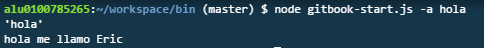

# Empezando a tope

## Tutorial de como hacer la práctica

### Primer Paso

Empezamos borrando todo y añadiendo las carpetas bin para meter el script que se iniciará al ejecutar
nuestro paquete npm. También metemos la carpeta template que tendrá los ficheros que pasarán a ser
la estructura principal de nuestro proyecto. 

### Segundo paso

Cambiaremos el nombre del hombre que hizo el repo inicial por una variable que se sustituirá posteriormente
para ello donde está su nombre pondremos <%= variable %>

### Tercer paso

Entendiendo el proceso del minimist, una vez instalado el módulo vemos que podemos separar argumentos,
y así poder acceder a cada uno de los parámetros, por ahora tenemos esto.

        var argv = require('minimist')(process.argv.slice(2));
        console.dir(argv.a);
        
        
        
        if(argv.a){
            console.log("hola me llamo Eric");
            
        }

Ahora el objetivo sería empezar a planificar el script, y ver que hacemos con los .ejs como podemos 
traducirlos para que se copien, para ello seguramente tendremos que hacer uso de alguno de los módulos
de node que nos permita copiar carpetas. Veamos el módulo Filesystem.

fs-extra que es el que nos venía nos permite crear una carpeta con un parámetro que le pasemos, en
este caso usamos la a para indicar el nombre. 1 paso listooo :) un paso menos.

        
        fs.mkdirsSync('../'+argv.a);
        

## Cuarto paso

Una vez tenemos el nombre tenemos que pasar todos los archivos de una carpeta a otra, como hemos tenido
problemas con el módulo fs, usamos el ncp 

    // Copiamos todos los archivos

    ncp("../template", "../" + argv.a, function (err) {
     if (err) {
       return console.error(err);
     }
     console.log('done!');
    });

