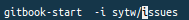
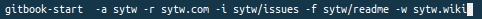

## Opciones del uso del comando Gitbook-start 

####  ``` gitbook-start [opción][parametro] ```
---
#### --Opciones que se pueden llevar a cabo para el correcto funcionamiento de la práctica
---
```  -a ```->  Con el comando gitbook-start -a [Nombre] estamos indicando que la carpeta que se creará se 
              llamará nombre al igual que su autor
                
---
``` -r ``` ->  Con el comando gitbook-start -r [Dirurl] le asignamos la dirección url que le corresponda
                
---            
``` -i ``` ->  Con el comando gitbook-start -i [issues] se le asigna la issues 
                
---                
``` -f ``` ->  Con el comando gitbook-start -l [Readmeurl] estamos añadiendole la homepage que tiene
                
---                
``` -w ``` ->  Con el comando gitbook-start -w [wikiurl] se está añadiendo la wiki del repositorio
                
                
---        
#### --Estas son las opciones que podemos llevar a cabo,cualquiera que no correspondan con las anteriores no se podrán efectuar
---
#### --Un ejemplo de como se debe realizar correctamnete es el siguiente
                
